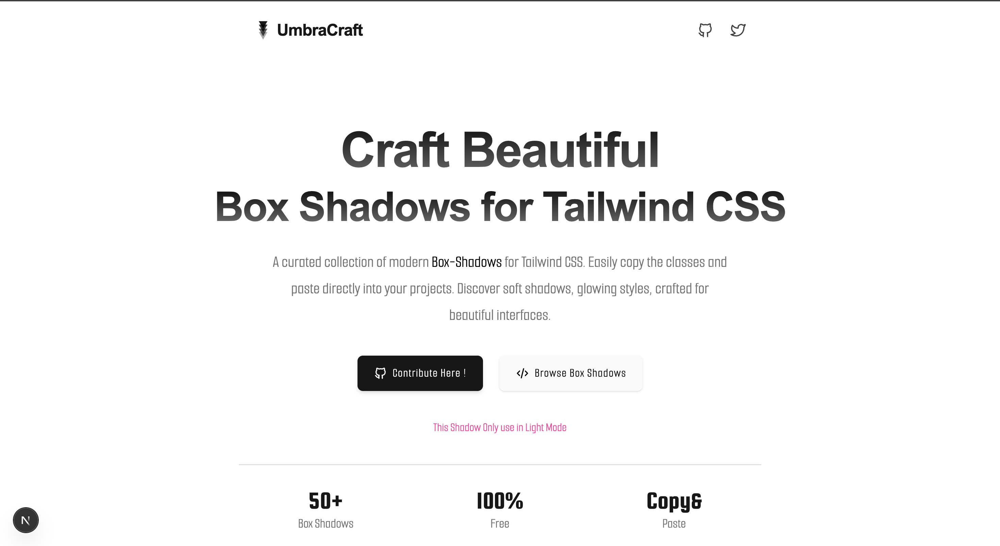
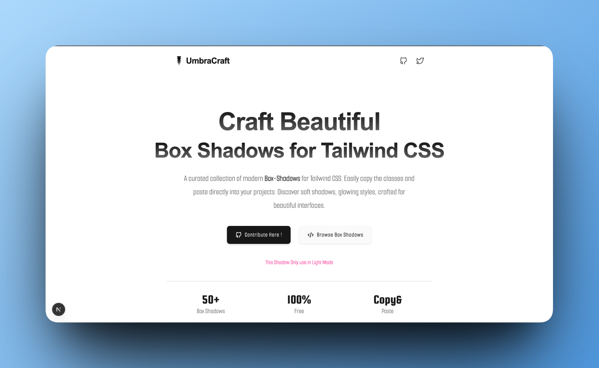
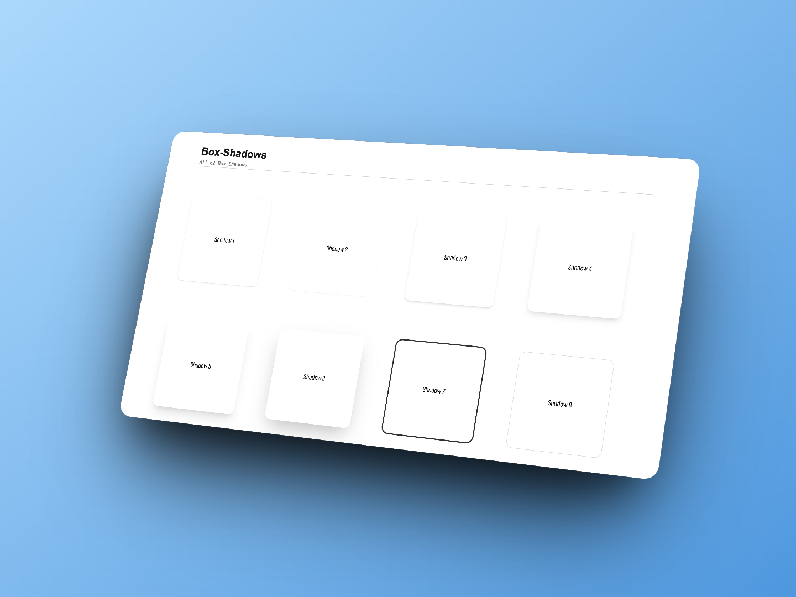
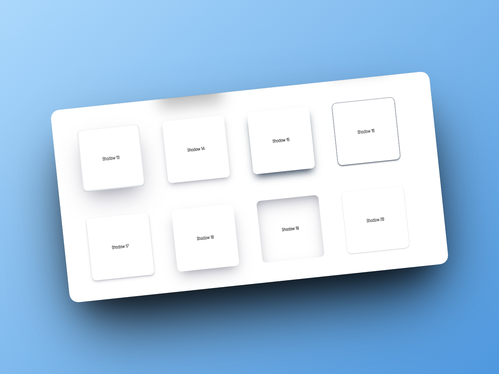
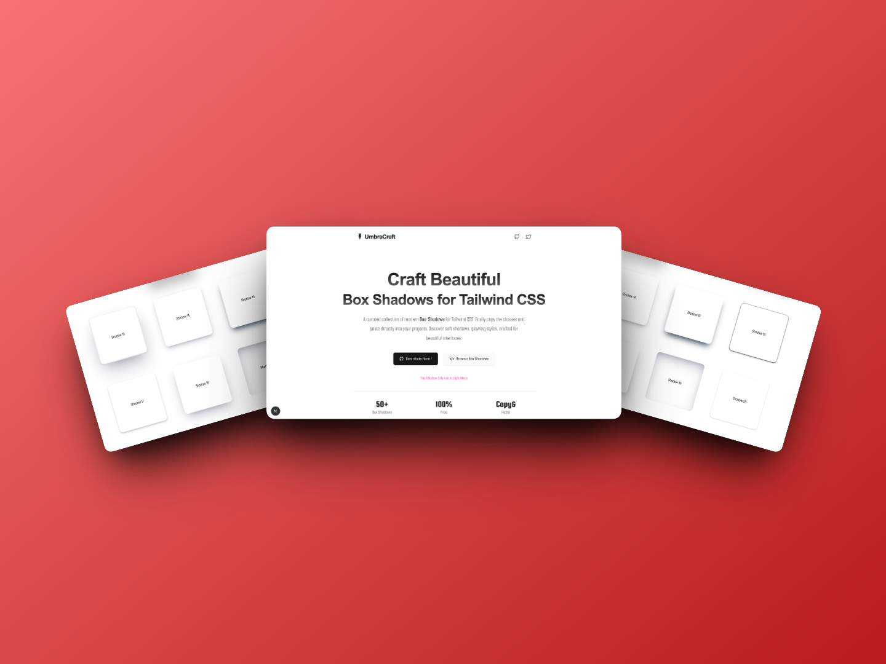

# ✨ UmbraCraft

A modern collection of beautifully crafted box shadows for developers and designers.

Built for frontend developers, UI designers, founders, and creators who care about clean and beautiful interfaces 💫



A curated collection of modern Box-Shadows for Tailwind CSS. Easily copy the classes and paste directly into your projects. Discover soft shadows, glowing styles, crafted for beautiful interfaces.

---
Visit: <a href="https://umbracraft.vercel.app">UmbraCraft</a>









---

## ⚡ Tech Stack

- Next.js
- Tailwind CSS
- TypeScript

---

## 🛠 Features

- Modern box shadow collection
- Clean UI
- Easy copy & paste usage
- Developer friendly

---

##  Installation

Clone the repository:

```bash
git clone https://github.com/yourusername/umbracraft.git
```

Go to project folder:

```bash
cd umbracraft
```

Install dependencies:

```bash
npm install
```

Start development server:

```bash
npm run dev
```

---

## 💫 Built For

- Frontend Developers
- UI/UX Designers
- Indie Hackers
- Startup Founders
- Creative Developers

---

## 📄 License

MIT License
